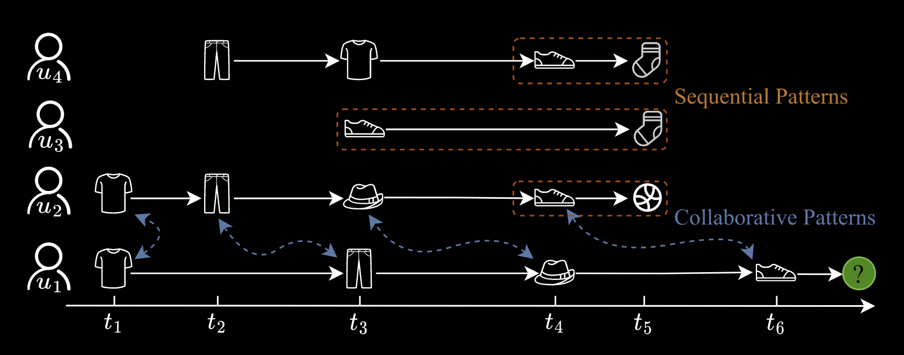
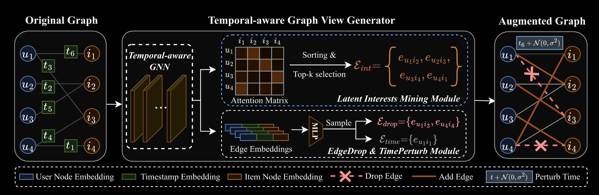
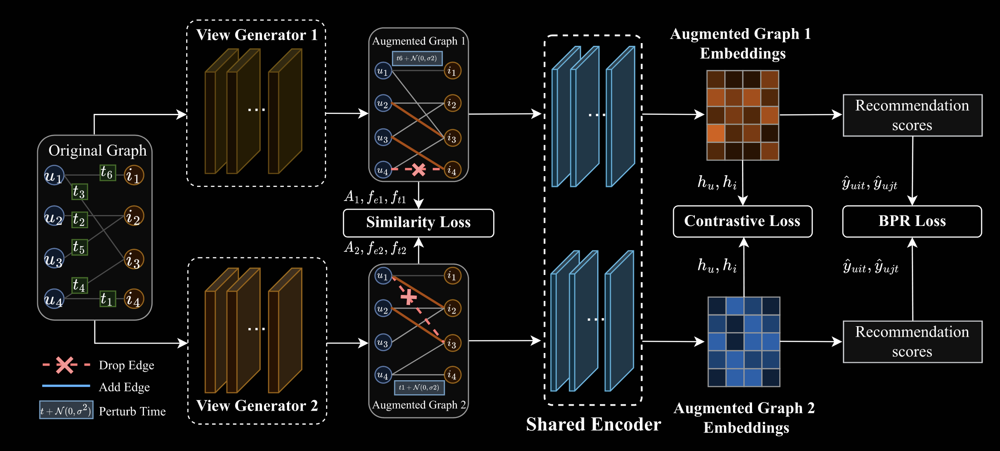

# Реализовать сервис рекомендаций, использующий подход TagRec

В [работе](https://ieeexplore.ieee.org/document/10872817) описывается подход TagRec для последовательных рекоммендаций.

## Задача:

Берляндия, 2025 год.
В этой высокотехнологичной стране давно уже всё автоматизировано — от поставки борща по подписке до расписания умных тостеров. Однако с развитием цифровой экономики берлянцы столкнулись с неожиданной проблемой: алгоритмы рекомендаций больше не справляются. Люди жалуются: им советуют одно и то же, будто у них нет права на внезапно захотеть что-то новое.

Министерство Персонализированного Удовлетворения (МПУ) создало проект национального значения — РекомменДУН: сверхумную систему, способную предсказывать интересы берлянцев раньше, чем они сами об этом подумают.

Тебя, как одного из лучших инженеров Академии Искусственного Интеллекта Берляндии (АИИБ), привлекли в команду разработчиков РекомменДУН.
Твоя задача — построить интеллектуальный движок рекомендаций, который станет ядром всей цифровой инфраструктуры страны.

Для этого тебе предстоит выполнить технические пункты, приведённые в критериях оценивания ниже. Если у тебя останется вдохновение (и немного борща), можешь взяться за дополнительные задачи — они не обязательны, но помогут тебе глубже понять, как устроены рекомендательные системы нового поколения.

Успешная реализация проекта означает запуск в национальном масштабе — с интеграцией в каждую микроволновку, холодильник и цифровое кресло в Берляндии.

Добро пожаловать в проект РекомменДУН.
Берляндия верит в тебя.


# Формулировка проблемы последовательных рекоммендаций:

## A. Базовые понятия:

### Определение 1 (Временной двудольный граф):

Временной двудольный граф можно определить как $G = (\mathcal{U}, \mathcal{I}, \mathcal{E}, \mathcal{X})$, где $\mathcal{U}$ и $\mathcal{I}$ — это непересекающиеся множества пользователей и объектов соответственно.  $\mathcal{E} \subseteq \mathcal{U} \times \mathcal{I}$ обозначает множество рёбер между пользователями и объектами. Каждое ребро $e \in \mathcal{E}$ задаётся в виде тройки $e = (u, i, t)$, где пользователь $u$ взаимодействует с объектом $i$ в момент времени $t$, при этом $u \in \mathcal{U}, i \in \mathcal{I}, t \in \mathbb{Z}^+$ считаются атрибутами рёбер. 
$x_u, x_i \in \mathcal{X}$ обозначают признаки узлов для пользователя $u$ и объекта $i$.

## Постановка задачи:

Пусть $\mathcal{I}_u(T)$ обозначает множество объектов, с которыми пользователь $u$ взаимодействовал до момента времени $T$, а $\mathcal{I} \setminus \mathcal{I}_u(T)$ — оставшиеся объекты. 
$\mathcal{E}_T \subseteq \mathcal{E}$ включает все исторические взаимодействия между пользователями $\mathcal{U}$ и объектами $\mathcal{I}$ до момента времени $T$.

Задача рекомендательной системы с непрерывным временем формулируется следующим образом:

### Определение 2 (Рекомендация в непрерывном времени):

Для заданного пользователя $u$ и момента времени $T$, при наличии множества временных меток $\mathcal{T'} = \{ t \mid t > T \}$ и временного двудольного графа, построенного на основе $\mathcal{E}_T$, цель состоит в ранжировании объектов из $\mathcal{I} \setminus \mathcal{I}_u(T)$ на каждом $t \in \mathcal{T'}$ по вероятности интереса пользователя $u$.

Постановка задачи следует подходу, где подчёркивается важность новизны через рекомендацию новых, ранее невидимых объектов, а не повторение уже известных взаимодействий. Это позволяет избежать избыточности и улучшить пользовательский опыт. Такой подход подчёркивает способность системы выявлять потенциальные интересы пользователей и исследовать ранее не наблюдавшиеся взаимодействия, что способствует более разнообразным и релевантным рекомендациям.



## Подход

Подход состоит из двух частей:

* Генератора графовых представлений с учётом времени
* Контрастного обучения в TagRec

### Генератор графовых представлений с учетом времени (Temporal-aware Graph View Generator)



Псевдокод алгоритма генератора графовых представлений:

```py
# Algorithm: Temporal-Aware Graph View Generator

def temporal_aware_graph_view_generator(G):
    # G = (U, I, E, X)
    U, I, E, X = G

    # Temporal-aware Graph Neural Network
    Hu, Hi = GNN(U, I, E, X)

    # Latent Interests Mining Module
    A = softmax((W1 @ Hu) @ (W2 @ Hi).T)
    E_int = {(u, i) for u in U for i in top_k(A[u])}

    # Temporal-aware Edge Dropping Module
    C = {}
    for (u, i, t) in E:
        C[(u, i, t)] = concatenate([Hu[u], Phi(t), Hi[i]])

    p_e = FUNC(C)
    f_e = gumbel_softmax(p_e)
    E_drop = AUG_drop(E, f_e)

    # Temporal Information Perturbation Module
    p_t = FUNC(C)
    f_t = gumbel_softmax(p_t)
    E_time = AUG_time(E, f_t)

    # Reconstruct augmented graph
    G_prime = reconstruct_graph(U, I, E_int, E_drop, E_time, X)

    return G_prime  # (U', I', E', X')
```

Цель генератора графов — создать аугментированное представление графа путём обучения его эмбеддингов. Он включает четыре ключевых компонента: 
*TA-GNN*, *модуль извлечения скрытых интересов*, *модуль удаления рёбер* и *модуль искажения временной информации*.

1) TA-GNN:

    Обучает представления узлов, учитывая временные характеристики. На каждом слое $l$ эмбеддинги пользователей $u \in \mathcal{U}$ обновляются следующим образом:

    $$
    m_u^{(l)} = \text{AGG}^{(l)}(\{h_i^{(l - 1)} + \Phi^{(l-1)}(t) | (u,i,t) \in \mathcal{E}, i \in \mathcal{N}_1(u)\})
    $$

    $$
    h_u^{(l)} = \text{UPDATE}^{(l)}(h_u^{(l-1)}, m_u^{(l)})
    $$


    где $\Phi(t)$ — временное встраивание, $\mathcal{N}_1(u)$ — одношаговые соседи.

2) Модуль извлечения скрытых интересов:

    На основе эмбеддингов пользователей $H_u \in \mathbb{R}^{|\mathcal{U}| \times d}$ и объектов $H_i \in \mathbb{R}^{|\mathcal{I}| \times d}$ вычисляется матрица внимания:

    $$
    A = \text{Softmax}((W_1 H_u)(W_2 H_i)^{T})
    $$

    Элементы $A_{ui}$ отражают интерес пользователя $u$ к объекту $i$. Для каждого пользователя выбираются top-$k$ объектов с наибольшими значениями $A_{u*}$:

    $$
    \text{Top-k}(A_{u*}) = \{i_1, \dots, i_k \mid A_{ui_1} \geq \dots \geq A_{ui_{|\mathcal{I}|}},\; i_j \in \text{arg sort}(A_{u*})\}
    $$

    Аугментированные рёбра формируются как:

    $$
    \mathcal{E}_{\text{int}} = \{(u, i) \mid i \in \text{Top-k}(A_{u*}) \;\text{для всех}\; u \in \mathcal{U}\}
    $$

3) Модуль удаления рёбер:
   
    Убирает неинформативные рёбра из графа. Для каждого ребра $(u, i, t) \in \mathcal{E}$ формируется представление:

    $$
    p_e = \text{FUNC}(h_u \parallel \Phi(t) \parallel h_i) \\
    f_e = \text{GumbelSoftmax}(p_e) \\
    \mathcal{E}_{\text{drop}} = \text{AUG}_{\text{drop}}(\mathcal{E}, f_e)
    $$

    где $f_e$ — вероятности удаления рёбер, $\parallel$ обозначает конкатенацию.

4) Модуль искажения временной информации:

    Добавляет шум в метки времени взаимодействий:

    $$
    p_t = \text{FUNC}(h_u \parallel \Phi(t) \parallel h_i) \\
    f_t = \text{GumbelSoftmax}(p_t) \\
    \mathcal{E}_{\text{time}} = \text{AUG}_{\text{time}}(\mathcal{E}, f_t)
    $$

    Для выбранного ребра $e = (u, i, t)$ модифицированная временная метка получается:

    $$
    t' = t + \mathcal{N}(0, \lambda \cdot \Delta_u(t)^2)
    $$

    где $\Delta_u(t)$ — минимальный интервал между действиями пользователя $u$, $\lambda$ — гиперпараметр. Такое искажение сохраняет семантический порядок взаимодействий и обеспечивает устойчивость модели.


### Контрастное обучение в TagRec



Для обучения используется 3 типа ошибок:

* $\mathcal{L}_{sim}$ - Similarity Loss
* $\mathcal{L}_{cl}$ - Contrastive Loss
* $\mathcal{L}_{bpr}$ - Bayesian Personalized Ranking(BPR) Loss

$\mathcal{L}_{sim}$ сосредоточена на минимизации взаимной информации между представлениями, создаваемыми двумя генераторами видов (view generators).

$\mathcal{L}_{cl}$ направлена на усиление согласованности между положительными парами $z_i, z_j$ по сравнению с отрицательными.

$\mathcal{L}_{bpr}$ широко используется в задачах ранжирования для top-N рекомендаций.

### Similarity Loss

Для функции потерь сходства, следуя принципу InfoMin, используются два различных генератора графов, создающих разные представления одного и того же графа, с целью минимизации взаимной информации между ними.

В процессе извлечения скрытых интересов пользователей, матрица внимания $\mathbf{A}$ представляет собой аугментационную операцию.  
Для модуля удаления рёбер и модуля искажения временной информации используются сэмплированные матрицы состояний $\mathbf{f}_e$ и $\mathbf{f}_t$ (Из раздела "Генератор графовых представлений с учетом времени"), каждая из которых указывает, какое преобразование было применено к соответствующему ребру.

Формула функции потерь сходства задаётся следующим образом:

$$
\mathcal{L}_{\text{sim}} = \text{sim}(\mathbf{A}_1, \mathbf{A}_2) + \text{sim}(\mathbf{f}_{e1}, \mathbf{f}_{e2}) + \text{sim}(\mathbf{f}_{t1}, \mathbf{f}_{t2})
$$

Для каждой тестовой тройки $(u, i, t)$ модель-кодировщик генерирует эмбеддинги пользователя $u$ и объекта $i$, обозначаемые как $\mathbf{e}_u$ и $\mathbf{e}_i$ соответственно. Предсказанный скор (оценка) для рекомендации объекта $i$ пользователю $u$ во времени $t$ определяется следующим образом:

$$
\hat{y}_{uit} = \mathbf{e}_u \cdot \mathbf{e}_i
$$

где $\hat{y}_{uit}$ — итоговая предсказанная оценка, отражающая степень релевантности объекта $i$ для пользователя $u$ в момент времени $t$.


### Contrastive Loss

Для контрастной функции потерь используется нормализованная температурно-масштабированная кросс-энтропия (NT-XEnt), с применением механизма самодискриминации узлов для генерации положительных и отрицательных пар.

Для узлов-пользователей представления одного и того же узла $u$ в один и тот же момент времени $t$ считаются положительными парами:

$$
(h'_{ut}, h''_{ut}) \quad \text{где} \; u \in \mathcal{U},\; t \in \mathcal{T},
$$

а представления разных узлов считаются отрицательными:

$$
(h'_{u_i t_i}, h''_{u_j t_j}) \quad \text{где} \; u_i \neq u_j,\; u_i, u_j \in \mathcal{U},\; t_i, t_j \in \mathcal{T}.
$$

Контрастная функция потерь для пользователей определяется как:

$$
\mathcal{L}_{cl}^{\text{user}} = 
\sum_{u_i \in \mathcal{U}} \sum_{t_i \in \mathcal{T}} 
-\log \frac{
\exp\left( \text{sim}(h'_{u_i t_i}, h''_{u_i t_i}) / \tau \right)
}{
\sum_{u_j \in \mathcal{U}} \sum_{t_j \in \mathcal{T}} 
\exp\left( \text{sim}(h'_{u_i t_i}, h''_{u_j t_j}) / \tau \right)
}
$$

где $\tau$ — температурный параметр, а $\text{sim}(\cdot, \cdot)$ — косинусное сходство, определяемое как:

$$
\text{sim}(h_i, h_j) = \frac{h_i \cdot h_j}{\|h_i\|_2 \cdot \|h_j\|_2}
$$

Контрастная функция потерь для объектов $\mathcal{L}_{cl}^{\text{item}}$ вычисляется аналогично.  
Итоговая контрастная функция потерь записывается как:

$$
\mathcal{L}_{cl} = \mathcal{L}_{cl}^{\text{user}} + \mathcal{L}_{cl}^{\text{item}}
$$

### Bayesian Personalized Ranking(BPR) Loss

Функция потерь BPR (Bayesian Personalized Ranking) предполагает, что объекты с наблюдаемой неявной обратной связью должны иметь более высокие предсказанные оценки, чем ненаблюдаемые.  
Для графа $G$ и его аугментированных графов $G_1$ и $G_2$, функция потерь BPR для графа $G$ задаётся как:

$$
\ell^{G}_{\text{bpr}} = \sum_{(u,i,j,t) \in \mathcal{O}_T^G} -\log \sigma(\hat{y}_{uit} - \hat{y}_{ujt})
$$

где $\mathcal{O}_T^G$ — обучающая выборка, а $\sigma(\cdot)$ — сигмоидная функция.

Обучающие тройки формируются следующим образом:

$$
\mathcal{O}_T^G = \left\{ (u, i, j, t) \;\middle|\; (u, i, t) \in \mathcal{E},\; j \in \mathcal{I} \setminus \mathcal{I}_u(t) \right\}
$$
где $\mathcal{I}_u(t)$ — множество объектов, с которыми пользователь $u$ взаимодействовал до времени $t$. Объекты $j$ выбираются случайным образом из ненаблюдаемых.

Общая функция потерь BPR включает:
$$
\mathcal{L}_{\text{bpr}} = \ell^{G}_{\text{bpr}} + \ell^{G_1}_{\text{bpr}} + \ell^{G_2}_{\text{bpr}}
$$

Полная функция ошибки TagRec описывается как: $\mathcal{L} = \mathcal{L}_{sim} + \mathcal{L}_{cl} + \mathcal{L}_{bpr}$

## Критерии оценивания

| №  | Компонент задания                                                                                 | Баллы | Описание                                                                                         |
|----|-----------------------------------------------------------------------------------------------------|--------|--------------------------------------------------------------------------------------------------|
| 1  | Реализация генератора графовых представлений с учетом времени                                       | 20     | Корректная реализация TA-GNN, модуля интересов, удаления рёбер и модуля искажения времени.       |
| 2  | Контрастное обучение (Contrastive + Similarity + BPR Loss)                                          | 20     | Реализация всех трёх типов потерь и корректное обучение модели на этих данных.                  |
| 3  | Формат входных графов и универсальность (гибкость признаков $\mathcal{X}$)                          | 15     | Поддержка произвольных признаков узлов, возможность обработки любого графа по формату.          |
| 4  | Интеграция сценариев применения (минимум два)                                                       | 10     | Примеры интеграции для разных задач (рекомендации товаров, музыки и т.д.)                        |
| 5  | Механизм автоматического дообучения                                                                 | 10     | Возможность обновления модели без переобучения с нуля при добавлении новых данных.              |
| 6  | Поддержка нескольких баз данных (PostgreSQL и SQLite)                                               | 10     | Возможность гибкой интеграции с двумя и более базами данных.                                     |
| 7  | Юнит-тесты, документация и описание модели                                                          | 5      | README, тесты, описание API и архитектуры модели.                                                |
| 8  | Эксперименты и метрики (Recall@K, NDCG, MRR и т.д.)                                                 | 10     | Отчет по качеству модели, сравнение до и после аугментаций, таблицы/графики.                    |
| 9  | (Опционально) Веб-интерфейс (рекомендации изображений, лайки/дизлайки и т.д.)                       | 5      | Простой сайт на Streamlit/FastAPI с визуализацией работы модели.                                |
| 10 | (Опционально) Сервис должен быть полностью написан на Golang              | 5      | Для последующей передачи на поддержку одной из команд и достаточно высокой производительности |
| 11 | (Опционально) Дополнительные фичи, исследования, масштабирование, логгирование                                   | 5      | Любые улучшения сверх требований: масштабируемость, кэширование, дебаг-метрики и т.д.           |

**Итого: 100 баллов за основные** , 15 баллов опциональные.

Для минимального выполнения задания(на уд.) надо выполнить задачи: 1,2,3,7


